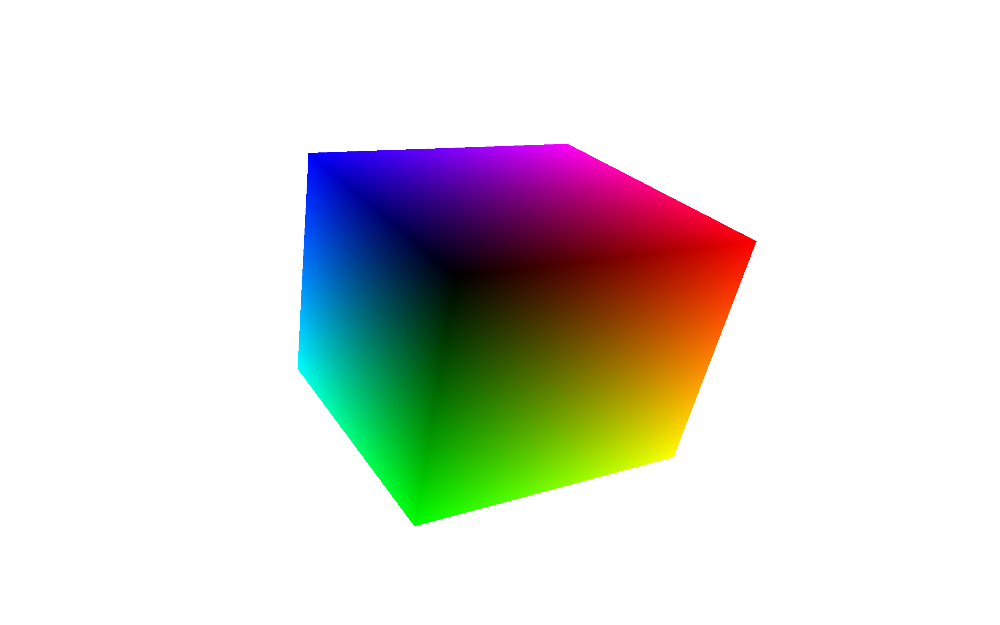

# Cube-RGB

<p align="center">
  
</p>

## What is it?

This repository contains an RGB cube designed with OpenGL, C++ and CMake

## How it works?

Each Vertex of this cube has a unique combination of 0s and 1s that form the colors of the cube.


## How to Execute?

First check if the dependencies are installed

```bash
sudo nala install freeglut3 freeglut3-dev libglfw3-dev libglm-dev libglew-dev libstb-dev libglm-doc
```

Generate the Makefile

```cmake
cmake -H. -BBuild -DCMAKE_RUNTIME_OUTPUT_DIRECTORY=./Bin
```

- `-H.` Procura pelo CMakeLists.txt no diretório autal
-  `-BBuild` Cola o Makefile gerado dentro da pasta Build
- `-DCMAKE_RUNTIME_OUTPUT_DIRECTORY=./Bin` Adiciona o executável final para a pasta ./Build./Bin

Finally, compile and run the program.

```make
make -C ./Build && ./Build/Bin/Cube-RBG
```